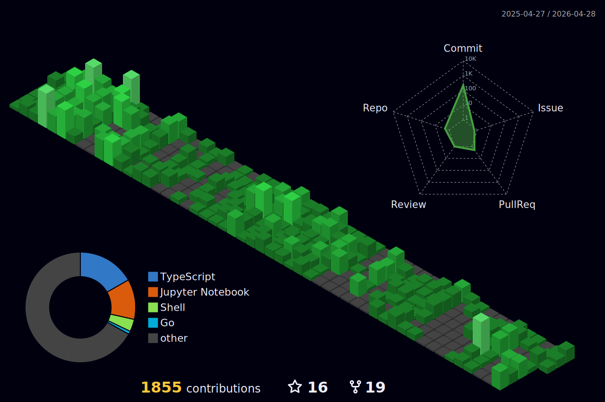

### 🏆 Awards

- 대한민국 제10회 SW융합 해커톤 대회 (2023): 대상(산업통상자원부 장관상)
- 2023년 AI+Security 아이디어 공모전: 최우수상(한국인터넷진홍원장상)
- 기술+인문사회 융합프로젝트 경진대회: 대상
- 기술+인문사회 융합프로젝트 경진대회: 우수상
- 2023 몰입형 SW 정규 교육과정 산출물 발표회: 금상
- 2023년HUSS 해커톤 :우수상 2등 (한국연구재단 이사장상)

- 大韓民国第10回SW融合ハッカソン大会(2023)： 大賞(産業通商資源部長官賞)
- 2023年AI+Securityアイデアコンテスト：最優秀賞(韓国インターネット振興院長賞)
- 技術+人文社会融合プロジェクト競進大会：大賞
- 技術+人文社会融合プロジェクトコンテスト: 優秀賞
- 2023 没入型SW正規教育課程成果物発表会：金賞
- 2023年HUSSハッカソン：優秀賞2位(韓国研究財団理事長賞)
  
### 📫 SNS

### 🌟 technical skill

<!-- " -->

<!--  -->
