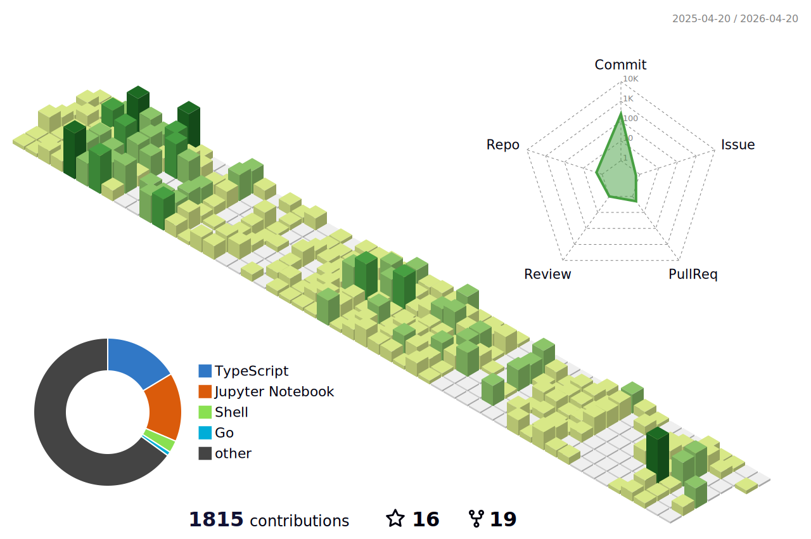

<!---->
🏆최근 수상 경력
•대한민국 제10회 SW융합 해커톤 대회 (2023)
  o 주제: 선박 AIS를 활용한 바다 수질 데이터 시각화 웹 서비스
  o 수상: 대상
  o 프로젝트 설명: 이 프로젝트에서는 수질 데이터를 수집하고 시각화하여 사용자들이 실시간으로 바다 수질을 모니터링할 수 있는
    웹 서비스를 제공했습니다. 이 프로젝트를 통해 데이터 처리, 웹 개발, 그리고 팀 협업 능력을 향상시킬 수 있었습니다.

<!--
**takaaaaaan/takaaaaaan** is a ✨ _special_ ✨ repository because its `README.md` (this file) appears on your GitHub profile.

Here are some ideas to get you started:

- 🔭 I’m currently working on ...
- 🌱 I’m currently learning ...
- 👯 I’m looking to collaborate on ...
- 🤔 I’m looking for help with ...
- 💬 Ask me about ...
- 📫 How to reach me: ...
- 😄 Pronouns: ...
- ⚡ Fun fact: ...
-->
